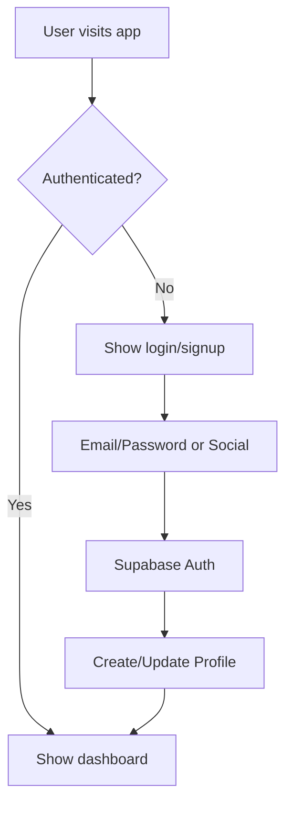
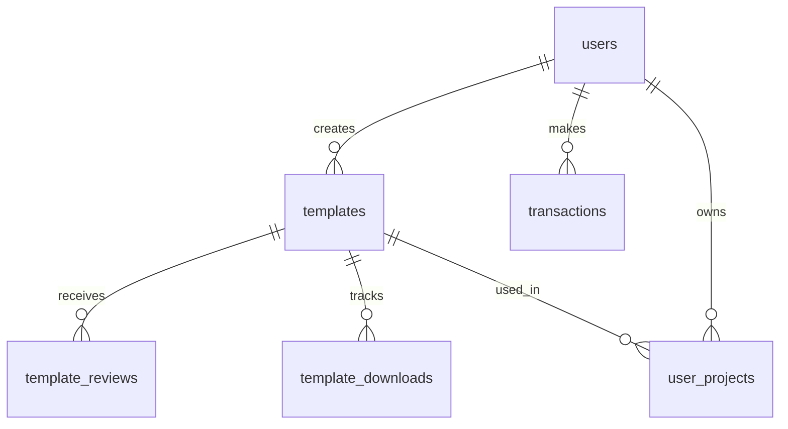

# 🚀 Supabase Setup Guide for BisnisBAIK Dashboard

This guide will walk you through setting up Supabase for your BisnisBAIK dashboard with user authentication, data storage, and analytics.

## 📋 Prerequisites

- [Supabase Account](https://supabase.com) (Free tier available)
- Node.js 16+ and npm
- Basic knowledge of SQL and database concepts

## 🎯 What We're Building

1. **User Authentication System**
   - Email/Password registration
   - Google OAuth integration
   - Facebook OAuth integration
   - Password reset functionality

2. **Data Storage**
   - User profiles and preferences
   - Template management (HTML/CSS/JS)
   - Transaction tracking
   - User projects and customizations

3. **Analytics Dashboard**
   - Template performance metrics
   - Revenue tracking
   - Download statistics
   - User engagement data

## 🏗️ Step-by-Step Setup

### Step 1: Create Supabase Project

1. Go to [supabase.com](https://supabase.com) and sign up/login
2. Click "New Project"
3. Choose your organization
4. Enter project details:
   - **Name**: `bisnisbaik-dashboard`
   - **Database Password**: Generate a strong password
   - **Region**: Choose closest to your users
5. Click "Create new project"
6. Wait for project setup (2-3 minutes)

### Step 2: Get Project Credentials

1. In your project dashboard, go to **Settings** → **API**
2. Copy the following values:
   - **Project URL** (e.g., `https://your-project.supabase.co`)
   - **Anon Public Key** (starts with `eyJ...`)

### Step 3: Configure Environment Variables

1. Create `.env` file in your project root:
```bash
# Supabase Configuration
VITE_SUPABASE_URL=https://your-project.supabase.co
VITE_SUPABASE_ANON_KEY=eyJhbGciOiJIUzI1NiIsInR5cCI6IkpXVCJ9...
```

2. **Never commit this file to version control!**

### Step 4: Set Up Database Schema

1. In Supabase dashboard, go to **SQL Editor**
2. Copy and paste the entire content of `supabase-schema.sql`
3. Click "Run" to execute the schema

This will create:
- `users` table for user profiles
- `templates` table for HTML templates
- `transactions` table for payment tracking
- `user_projects` table for user customizations
- `template_reviews` table for ratings
- `template_downloads` table for analytics

### Step 5: Configure Authentication

#### Email Authentication
1. Go to **Authentication** → **Settings**
2. Configure email templates:
   - **Confirm signup**: Customize welcome email
   - **Reset password**: Customize reset email
3. Set **Site URL** to your domain
4. Enable **Email confirmations**

#### Google OAuth
1. Go to **Authentication** → **Providers**
2. Click **Google**
3. Enable Google provider
4. Get OAuth credentials from [Google Cloud Console](https://console.cloud.google.com):
   - Create new project or select existing
   - Enable Google+ API
   - Create OAuth 2.0 credentials
   - Add authorized redirect URIs:
     - `https://your-project.supabase.co/auth/v1/callback`
     - `http://localhost:3000/auth/callback` (for development)
5. Copy **Client ID** and **Client Secret** to Supabase

#### Facebook OAuth
1. Go to **Authentication** → **Providers**
2. Click **Facebook**
3. Enable Facebook provider
4. Get OAuth credentials from [Facebook Developers](https://developers.facebook.com):
   - Create new app
   - Add Facebook Login product
   - Get **App ID** and **App Secret**
   - Add OAuth redirect URIs
5. Copy credentials to Supabase

### Step 6: Configure Row Level Security (RLS)

The schema already includes RLS policies, but verify they're working:

1. Go to **Authentication** → **Policies**
2. Ensure all tables have RLS enabled
3. Verify policies are created correctly

### Step 7: Set Up Storage (Optional)

For template thumbnails and assets:

1. Go to **Storage** → **Buckets**
2. Create bucket: `template-assets`
3. Set bucket to public
4. Configure policies for user access

### Step 8: Test the Setup

1. Start your development server:
```bash
npm run dev
```

2. Navigate to `/dashboard` to test authentication
3. Try registering a new user
4. Test social login (Google/Facebook)

## 🔧 Configuration Details

### Authentication Flow



### Database Relationships



## 🚨 Security Considerations

### Row Level Security (RLS)
- Users can only access their own data
- Public templates are viewable by everyone
- Private data is protected by user ID

### Authentication
- JWT tokens with expiration
- Secure password hashing
- OAuth integration with trusted providers

### API Security
- Rate limiting on public endpoints
- CORS configuration
- Input validation and sanitization

## 📊 Monitoring & Analytics

### Built-in Supabase Analytics
1. **Database Performance**: Monitor query performance
2. **Authentication Metrics**: Track login patterns
3. **Storage Usage**: Monitor file uploads
4. **API Usage**: Track request patterns

### Custom Analytics
- Template download tracking
- Revenue analytics
- User engagement metrics
- Performance monitoring

## 🐛 Troubleshooting

### Common Issues

1. **Authentication Errors**
   - Check environment variables
   - Verify OAuth redirect URIs
   - Check Supabase project status

2. **Database Connection Issues**
   - Verify project URL and API key
   - Check RLS policies
   - Verify table permissions

3. **OAuth Integration Problems**
   - Check provider configuration
   - Verify redirect URIs
   - Check app credentials

### Debug Mode

Enable debug logging in development:
```typescript
const supabase = createClient(supabaseUrl, supabaseAnonKey, {
  auth: {
    debug: true
  }
});
```

## 🔄 Next Steps

### Immediate
1. Test all authentication methods
2. Verify database operations
3. Set up monitoring alerts

### Short Term
1. Implement email verification
2. Add user profile management
3. Set up automated backups

### Long Term
1. Implement advanced analytics
2. Add real-time notifications
3. Set up CI/CD pipeline

## 📚 Additional Resources

- [Supabase Documentation](https://supabase.com/docs)
- [Supabase JavaScript Client](https://supabase.com/docs/reference/javascript)
- [Row Level Security Guide](https://supabase.com/docs/guides/auth/row-level-security)
- [Authentication Best Practices](https://supabase.com/docs/guides/auth/auth-best-practices)

## 🆘 Support

If you encounter issues:

1. Check [Supabase Status](https://status.supabase.com)
2. Review [Supabase GitHub Issues](https://github.com/supabase/supabase/issues)
3. Join [Supabase Discord](https://discord.supabase.com)
4. Check project logs in Supabase dashboard

---

**Congratulations!** 🎉 You now have a fully functional Supabase backend for your BisnisBAIK dashboard. The system includes user authentication, secure data storage, and analytics capabilities.
